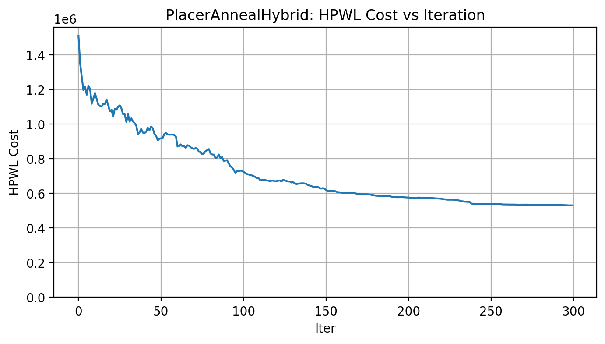

# MS Technical Paper

A study on placement algorithms for heterogenous FPGAs.

## Directories

**hdl/**: these are the HDL designs that we want to perform synthesis, placement, and routing on.  

**java/**: this is the program that runs our custom placement strategies via the RapidWright API.  

**latex/**: documents - proposal, the technical paper itself.  

**notes/**: notes I've taken on other papers I reference.  

**outputs/**: all output files created during the placement program's execution are generated here.   

**tcl/**: Tcl scripts to interface with Vivado.  

**run.sh**: the master script that coordinates `hdl/`, `java/`, `tcl/`, and `outputs/`.

## Simulated Annealing
SA placement of a 2048th order FIR filter with 32 parallel pipelines (timeslices):
(919 FLOP_LATCH, 1691 LUT, 282 CARRY, BMEM 32, MULT 64)

